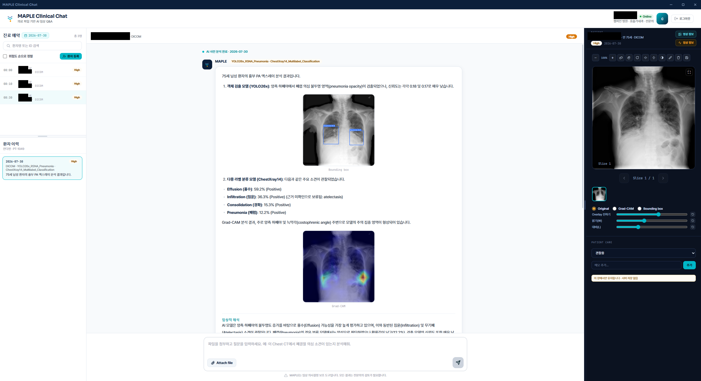
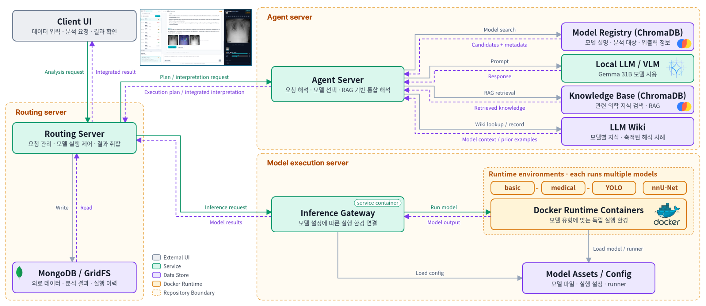

# SMC Agentic Orchestrator

**에이전트 기반 의료 AI 모델 통합 플랫폼**

자연어 요청과 의료 데이터를 받아 에이전트가 적합한 의료 AI 특화 모델을 **선택·실행**하고,
모델 결과와 외부 지식을 **하나의 임상 해석**으로 통합합니다.

<p align="center">
  
</p>

<table align="center">
  <tr>
    <td align="center" width="200"><h2>94</h2>의료 AI 모델</td>
    <td align="center" width="200"><h2>8</h2>진료과</td>
    <td align="center" width="200"><h2>7</h2>데이터 모달리티</td>
    <td align="center" width="200"><h2>0.861</h2>평균 AUROC<br><sub>VLM 단독 0.708 대비 +0.153</sub></td>
  </tr>
</table>

---

## 배경

의료 AI 모델은 모델마다 **입력 형식, 실행 환경, 출력 구조가 달라** 하나의 워크플로에서 함께 쓰기 어렵고,
범용 VLM 하나만으로는 전문 영역의 정확도에 한계가 있습니다.
이 플랫폼은 에이전트가 요청을 이해하고, 알맞은 특화 모델을 실행한 뒤, 결과를 하나로 묶어 해석하도록 합니다.

---

## 시스템 아키텍처

<p align="center">
  
</p>

| 서버 | 역할 |
|---|---|
| **[Routing Server](routing-server/)** | 요청 관리 · 모델 실행 제어 · 결과 취합. 의료 데이터와 분석 결과, 실행 이력은 MongoDB / GridFS에 저장 |
| **[Agent Server](agent-server/)** | 요청 해석 · 모델 선택 · RAG 기반 통합 해석. Model Registry, Knowledge Base(ChromaDB), Local LLM/VLM(Gemma 31B), LLM Wiki 활용 |
| **[Model Execution Server](model-execution-server/)** | Inference Gateway가 모델 설정에 따라 basic · medical · YOLO · nnU-Net Docker runtime으로 연결해 추론 실행 |

---

## 에이전트 워크플로

<!-- TODO: 에이전트 워크플로 이미지 -->

1. **요청 분석 및 계획** — 요청·영상·모델 메타데이터를 분석해 모델을 선택하고 실행 계획(DAG)을 세웁니다.
2. **모델 실행** — 모델을 순차·병렬로 실행하고 예측 결과와 시각적 근거(Grad-CAM, ROI, 분할 등)를 모읍니다.
3. **결과 통합 및 해석** — RAG · LLM Wiki로 모델 결과와 외부 지식을 연결해 최종 해석을 제공합니다.

추론 모드는 기본값인 **`auto`** 로 동작합니다. LLM이 요청 유형을 판단해 특화 모델 실행, 임상 지식 질의응답,
첨부파일 종합 분석 중 알맞은 흐름으로 자동 분기합니다.

---

## 결과

### 등록 모델

| 모달리티 | 모델 수 | 대표 태스크 |
|---|---:|---|
| X-ray | 30 | 분류 / 검출 |
| CT | 23 | 분할 / 정량화 |
| MRI | 17 | 분할 / 키포인트 |
| 피부 · 내시경 | 11 | 분류 / 분할 |
| 생체신호 · ECG | 7 | 예측 |
| 안저 · OCT | 2 | 분류 |
| 기타 | 4 | 분류 |

### 공개 벤치마크 (AUROC)

공개 벤치마크 8종, 총 32,518건에서 VLM 단독(GPT5.6 Luna)과 비교했습니다.

| Dataset | Modality | VLM | **Ours** |
|---|---|---:|---:|
| MIMIC-CXR | X-ray | 0.820 | **0.845** |
| Montgomery (NLM TB) | X-ray | 0.814 | **0.898** |
| CT-RATE | CT | 0.643 | **0.713** |
| PTB-XL | ECG | 0.682 | **0.827** |
| FracAtlas | X-ray | 0.784 | **0.935** |
| GRAZPEDWRI-DX | X-ray | 0.853 | **0.999** |
| Knee OA (OAI) | X-ray | 0.715 | **0.932** |
| SPIDER | MRI | 0.458 | **0.852** |
| **Mean** | | 0.708 | **0.861** |

### 통합 해석 사례

<!-- TODO: 통합 해석 결과 사례 이미지 (MIMIC-CXR 흉부 X선) -->

---

## 저장소 구조

```text
SMC-agentic-orchestrator/
├── routing-server/            # 요청 라우팅 · 임상 데이터 관리
├── agent-server/              # 모델 선택 · RAG · LLM Wiki · VLM 해석
└── model-execution-server/    # Inference Gateway + GPU runtime
```
